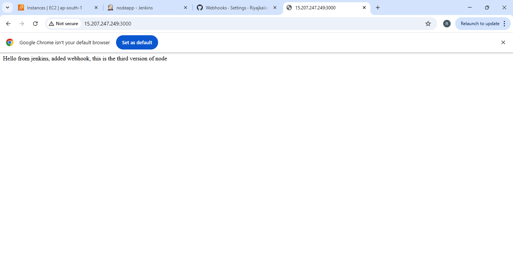
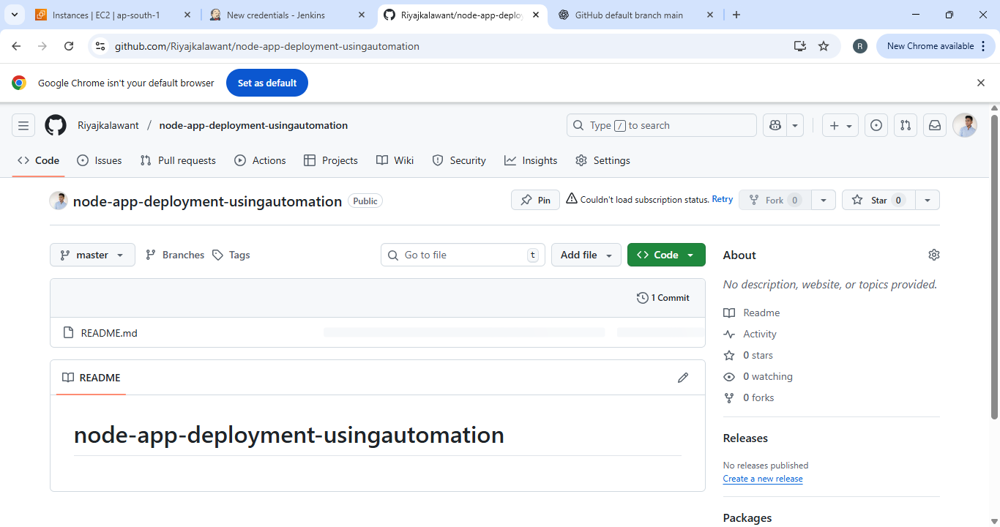

#  Node.js CI/CD Pipeline using Jenkins and Ubuntu Server

##  Project Overview
This is a **Node.js application** deployed automatically to an **Ubuntu server** using a **Jenkins CI/CD pipeline**.  
It also includes **GitHub webhook integration** for automatic builds and **email notifications** for build status updates.

The goal of this project is to demonstrate complete DevOps automation — from code push to live deployment.

---

##  Technologies Used
- **Node.js** – Backend Application Framework  
- **Git & GitHub** – Version Control and Source Management  
- **Jenkins** – Continuous Integration & Deployment  
- **Ubuntu Server** – Hosting Environment  
- **PM2** – Node.js Process Manager  
- **Shell Scripts** – For automation  
- **Email Notifications** – Jenkins Email Extension Plugin  

---

#  Screenshots

---

##  1. Local Node.js App output


---

##  2. GitHub Repository


---

##  3. Jenkins Build Dashboard


---

##  4. GitHub Email Notification  


---

##  CI/CD Workflow


### 1.  Local Development
Develop the Node.js application locally:
```bash
npm install
npm start


2.  Push Code to GitHub
Push your code to a remote repository:

bash
Copy code
git init
git add .
git commit -m "Initial commit"
git remote add origin https://github.com/riyajkalawant/nodejs-cicd-pipeline.git
git push -u origin main


3.  Jenkins Automation with Webhook
GitHub Webhook is configured to trigger Jenkins automatically whenever new code is pushed.

Jenkins performs the following steps:

Pull latest code from GitHub

Install dependencies

Build the project

Deploy automatically to the Ubuntu server


 Jenkins Pipeline (Jenkinsfile)
groovy
Copy code
pipeline {
    agent any

    environment {
        SSH_CRED = 'nodeappcicd'              // Jenkins credential ID
        SERVER_IP = '65.1.94.29'              // Replace with your EC2 public IP
        REMOTE_USER = 'ubuntu'
        WEB_DIR = '/var/www/html/'
    }

    stages {
        stage('Checkout') {
            steps {
                git 'https://github.com/riyajkalawant/nodejs-cicd-pipeline.git'
            }
        }

        stage('Install Dependencies') {
            steps {
                sh 'npm install'
            }
        }

        stage('Build') {
            steps {
                sh 'npm run build || echo "No build script defined"'
            }
        }

        stage('Deploy to Ubuntu Server') {
            steps {
                sshagent (credentials: [SSH_CRED]) {
                    sh """
                    ssh -o StrictHostKeyChecking=no ${REMOTE_USER}@${SERVER_IP} '
                        cd ${WEB_DIR} &&
                        git pull &&
                        npm install &&
                        pm2 restart app || pm2 start app.js --name app
                    '
                    """
                }
            }
        }
    }

    post {
        success {
            emailext (
                subject: " Jenkins Build Success - ${env.JOB_NAME} #${env.BUILD_NUMBER}",
                body: "Good news! The Jenkins build succeeded for ${env.JOB_NAME}.\n\nCheck your server deployment.",
                to: "riyajkalawant8@email.com"
            )
        }
        failure {
            emailext (
                subject: " Jenkins Build Failed - ${env.JOB_NAME} #${env.BUILD_NUMBER}",
                body: "Unfortunately, the Jenkins build failed.\n\nPlease check the console output for more details.",
                to: "riyajkalawant8@email.com"   
            )
        }
    }
}
github%20emailnotification.png)
4.  Email Notifications
Jenkins is configured with the Email Extension Plugin.

On every build (Success or Failure), an automatic email is sent to the configured address.


5.  Ubuntu Server Setup
1️ Install Node.js & npm

bash
Copy code
sudo apt update
sudo apt install nodejs npm -y
2️ Install PM2

bash
Copy code
sudo npm install -g pm2
3️ Clone and Run App

bash
Copy code
git clone https://github.com/riyajkalawant/nodejs-cicd-pipeline.git
cd nodejs-cicd-pipeline
npm install
pm2 start app.js


 CI/CD Flow Diagram
pgsql
Copy code
Local Machine → GitHub (Webhook) → Jenkins → Ubuntu Server → Email Notification
 Key Learnings
 Integrated GitHub Webhook with Jenkins
 Automated build and deployment pipeline
 Configured Email notifications for build updates
 Learned complete CI/CD workflow
 Managed Node.js app with PM2 on Ubuntu

 Conclusion
This project demonstrates a fully automated CI/CD pipeline for a Node.js application using Jenkins, GitHub, Ubuntu, and PM2.
It includes webhook triggers and email alerts, showcasing real-world DevOps automation for continuous integration and deployment.

 Author
Riyaj Kalawant
DevOps & Cloud Learner @ Fortune Cloud, Pune
 riyajkalawant@example.com
 https://github.com/riyajkalawant


